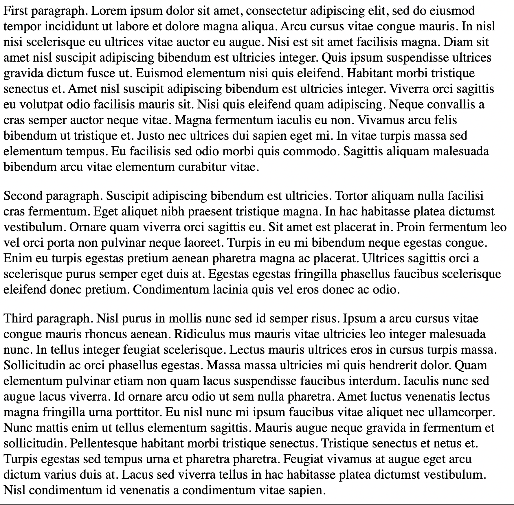
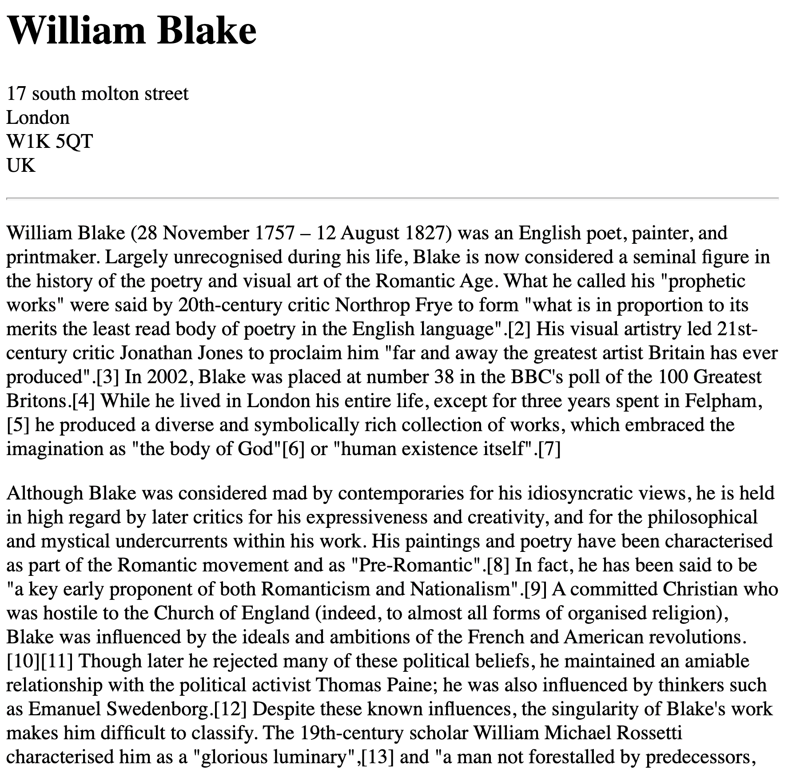

# Introduction to HTML

## What is HTML?


## HTML Tags


## Tags & Elements


### Section Heading Tags

#### Example Usage

```html
<h1>Heading 1</h1>
<h2>Heading 2</h2>
<h3>Heading 3</h3>
<h4>Heading 4</h4>
<h5>Heading 5</h5>
<h6>Heading 6</h6>
```

#### Exercise


See [01_section_heading_exercise.html](./src/01_section_heading_exercise.html)

#### Links

[HTML Section Headings Documentation](https://developer.mozilla.org/en-US/docs/Web/HTML/Element/Heading_Elements)

### Paragraph Tags

#### Example Usage

```html
<p>Paragraph 1</p>
<p>Paragraph 2 2</p>
```

#### Exercise



See [02_paragraph_exercise.html](./src/02_paragraph_exercise.html)

#### Links

[Lorem Ipsum](www.lipsum.com)

### Void Elements

Void Elements are tags which use no elements.

#### Example Usage

```html
<!-- horizontal rule element-->
<hr />
<!-- break elements -->
<br />
```

#### Exercise



See [03_void_elements.html](./src/03_void_elements_exercise.html)
