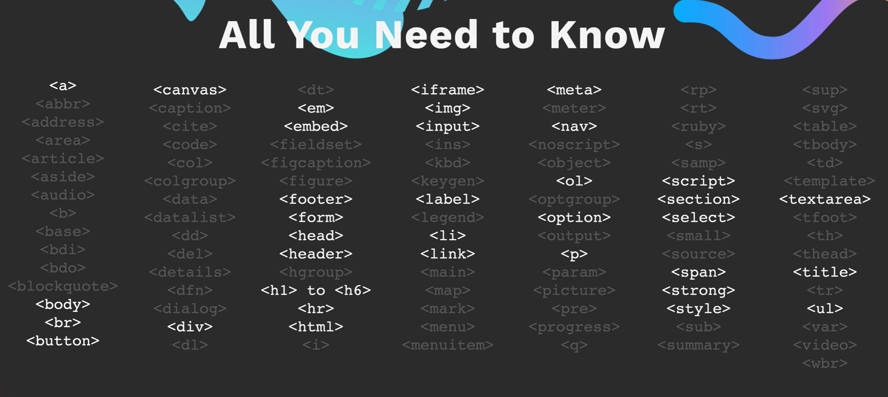

# Intermediate HTML

## HTML Tags



### The List Element

#### Example Usage

```html
<!-- Unordered list items creates bullet points -->
<ul>
  <li>List Item 1</li>
  <li>List Item 2</li>
  <li>List Item 3</li>
</ul>

<!-- Ordered list items creates numbered points -->
<ul>
  <li>List Item 1</li>
  <li>List Item 2</li>
  <li>List Item 3</li>
</ul>
```

#### Exercise


See [01_list_element_exercise.html](./src/01_list_element_exercise.html)

### Nesting and Indentation

#### Example Usage

```html
<!-- You can nest list items to create sub points -->
<!-- Idententing stuff makes things easier to read -->
<ul>
  <li>List Item 1</li>
  <li>List Item 2</li>
  <ul>
    <li>Sub Item 1</li>
    <ol>
      <li>Sub Sub Item 1</li>
    </ol>
  </ul>
</ul>
```

#### Exercise


See [02_nesting_and_indentation.html](./src/02_nesting_and_indentation_exercise.html)
