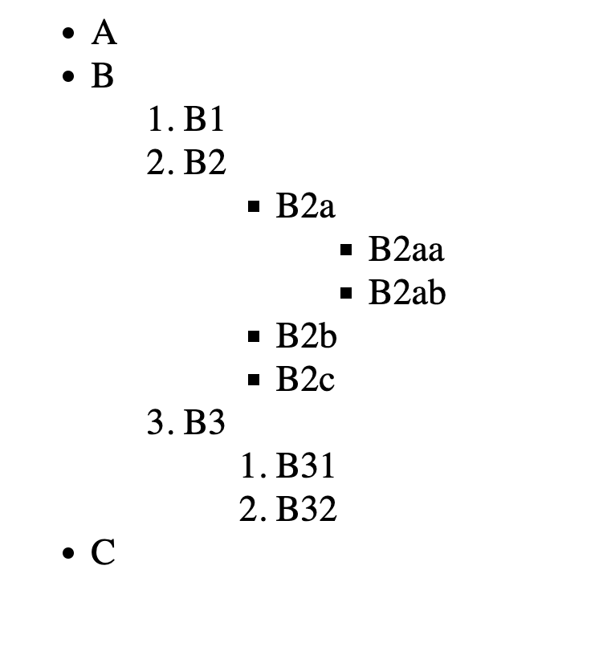

# Intermediate HTML

## HTML Tags


## The List Element

### Example Usage

```html
<!-- Unordered list items creates bullet points -->
<ul>
  <li>List Item 1</li>
  <li>List Item 2</li>
  <li>List Item 3</li>
</ul>

<!-- Ordered list items creates numbered points -->
<ul>
  <li>List Item 1</li>
  <li>List Item 2</li>
  <li>List Item 3</li>
</ul>
```

### Exercise


See [01_list_element_exercise.html](./src/01_list_element_exercise.html)

## Nesting and Indentation

### Example Usage

```html
<!-- You can nest list items to create sub points -->
<!-- Idententing stuff makes things easier to read -->
<ul>
  <li>List Item 1</li>
  <li>List Item 2</li>
  <ul>
    <li>Sub Item 1</li>
    <ol>
      <li>Sub Sub Item 1</li>
    </ol>
  </ul>
</ul>
```

### Exercise



See [02_nesting_and_indentation.html](./src/02_nesting_and_indentation_exercise.html)

## The Anchor Element

### Example Usage

```html
<!-- Lets you create hyperlinks -->
<!-- This is an inactive anchor element -->
<a>This is a link</a>

<!-- To make it active, we need to add an element attribute -->
<!-- Element attributes follow this pattern -->
<tag attribute="value">Content</tag>

<!-- Multiple attributes can be added -->
<tag attribute="value" attribute2="value">Content</tag>

<!-- So the anchor element with an attribute -->
<a href="https://www.google.com">Google Link</a>

<!-- Global attributes can be applied to all elements -->
```

### Exercise


See [03_anchor_exercise.html](./src/03_anchor_exercise.html)

### Links

[The Anchor Element Documentation](https://developer.mozilla.org/en-US/docs/Web/HTML/Element/a)

## The Image Element

### Example Usage

```html
<!-- image tag is a self closing tag, or a void element -->

```

### Exercise


See [04_image_exercise.html](./src/04_image_exercise.html)

### Links

[Random Picture Fetcher]("https://picsum.photos/)
