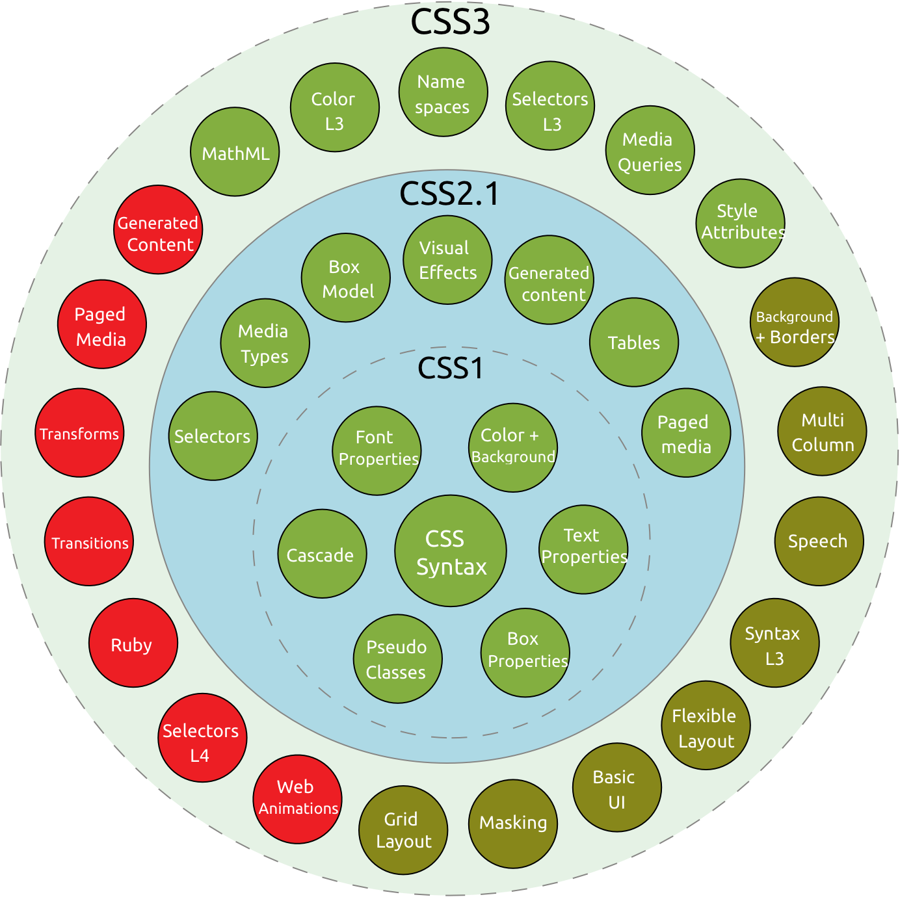
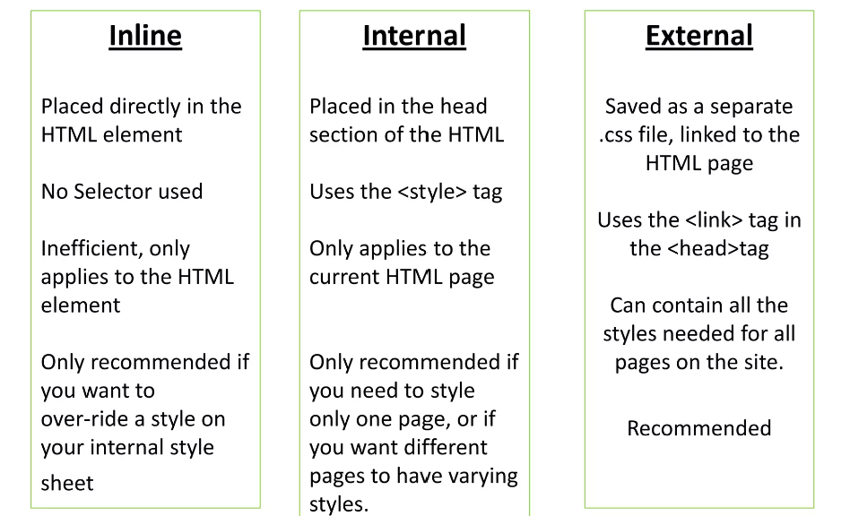

# Introduction to CSS

## Why do we need CSS?

CSS stands for Cascading Style Sheets. It's called this because the styling applies to more generic components and cascades into more specific components.

It is a style sheet language which allows programmers to style html pages.

Other style sheets include

- Sass
- Less
- and others

### History of CSS



## How to add CSS

CSS can be added in 3 ways:

1. Inline
1. Internal
1. External

### Applying CSS

CSS is broken into selectors, properties and values.




### Exercise

See [adding_css](./src/5.1.%20Adding%20CSS/index.html)

## CSS Selectors

For a summary of all CSS selectors, see [css_selections.pdf](./docs/css_selectors.pdf)

### Examples

```css
/* Type Selector: Selects all <p> elements */
p {
  font-size: 16px;
  color: #333;
}

/* Class Selector: Selects all elements with the class "highlight" */
.highlight {
  background-color: yellow;
}

/* ID Selector: Selects the element with the id "header" */
#header {
  font-size: 24px;
  color: blue;
}

/* Target Selector: Selects all <a> elements with a "target" attribute */
a[target] {
  color: red;
}

/* Target Selectors can be isolated to elements with specific target values */
p[draggable="false"] {
  color: red;
}

/* Universal Selectors: Applies to every elements */
* {
  color: red;
}
```

The difference between the id and class selector

- The class selector can be applied to many elements
- The ID selector can be applied to one element
- The ID value should be unique in the HTML file

### Exercise


See [css_selectors](./src/5.3%20CSS%20Selectors/index.html)

## Vocab Website Project


See [vocab_website_project](./src/5.4%20Colour%20Vocab%20Website/index.html)
