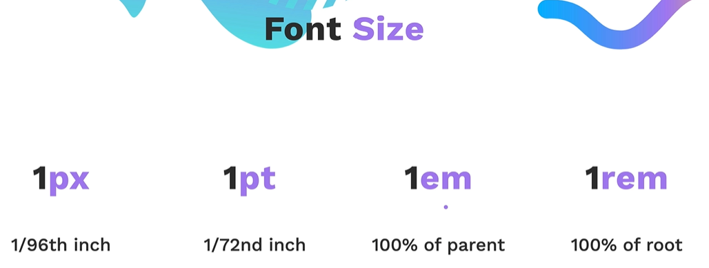
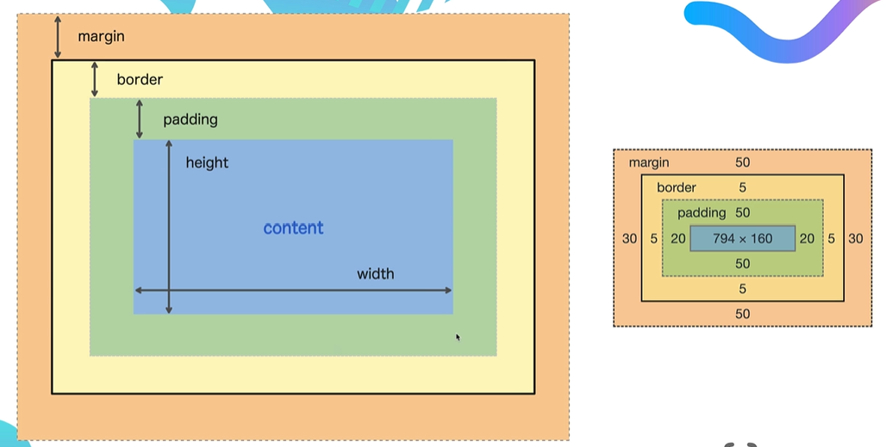

# CSS Properties

`Ctrl+Shift+J` brings up Chrome Dev Tools

## CSS Colours

### Exercise


See [index.html](./src/6.0%20CSS%20Colors/index.html)

### Links

- [Named Colours](https://developer.mozilla.org/en-US/docs/Web/CSS/named-color)
- [Colour Palette Generator](https://coolors.co/generate)

## Font Properties



### Exercise


See [index.html](./src/6.1%20Font%20Properties/index.html)

### Links

- [Google Fonts](https://fonts.google.com/)

## The Box Model



### Content Division Element

```html
<!-- Acts as an invisible box to contain content -->
<!-- Helps group multiple elements into divisions -->
<div>
  <p>Hello World</p>
  
</div>
```

### Exercise


See [index](./src/6.3%20CSS%20Box%20Model/index.html)

### Motivation Meme Project


See [index](./src/6.4%20Motivation%20Meme%20Project/index.html)
